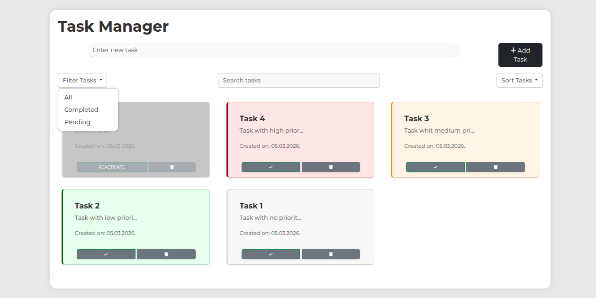
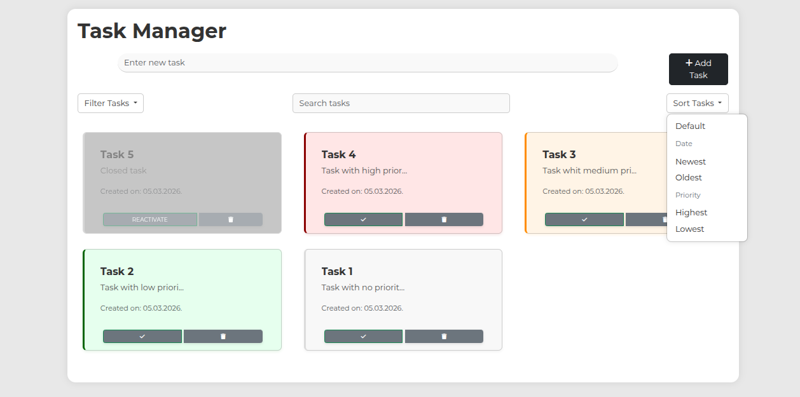
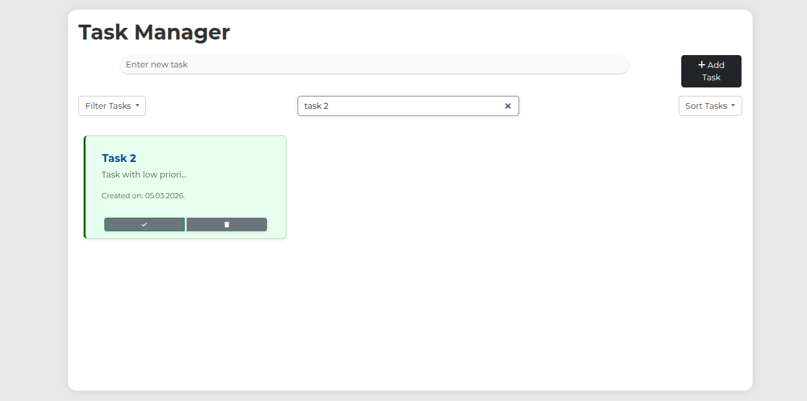

# Task Manager (Vanilla JavaScript)

A small task management app built as a learning/school project. It uses **vanilla JavaScript (ES modules)**, **Bootstrap**, and **LocalStorage** to manage tasks with a clean UI and simple UX patterns.

## Features
- Create, edit, and delete tasks
- Mark tasks as **completed** / **reactivate**
- Filter: **All / Completed / Pending**
- Sort by **date** (Newest/Oldest) and **priority** (Highest/Lowest)
- Search by title/description with highlighted matches
- UX details: modal-based editing, toast warnings, and “unsaved changes” protection

## Tech stack
- HTML5
- CSS3
- JavaScript (ES6+ modules)
- Bootstrap 5
- LocalStorage API

## Run locally
### Option A (quick)
Open `index.html` in your browser.

### Option B (recommended)
Run a simple local server:
```bash
python3 -m http.server 5173
```
Then open:
- http://localhost:5173

(You can also use VS Code **Live Server**.)

## Project structure
```txt
.
├── index.html
├── css/
│   └── styles.css
└── js/
    ├── main.js        # app init
    ├── events.js      # event listeners (CRUD, filters, sort, search)
    ├── storage.js     # LocalStorage CRUD
    ├── ui.js          # UI rendering + modal helpers
    ├── task.js        # Task model
    └── taskUtils.js   # filter/sort helpers + formatting
```

## Data storage
Tasks are stored in the browser using LocalStorage, so they persist after refresh/close (on the same device/browser).

## Status
This is a learning project and may be archived (not actively maintained).

## Screenshots





## License
See `LICENSE`.